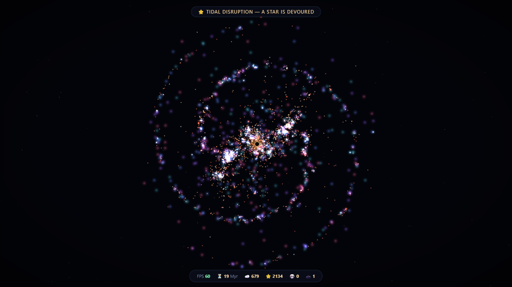

# Aevum

*A living cosmos that runs entirely in your browser — no build step, no
dependencies, no network.*

**▶ [Watch it live](https://kridev.github.io/aevum/)**

Open `index.html` and watch a universe happen. Gas falls together under
gravity until a knot ignites — a star is born, its colour set by its mass.
Blue giants burn furious and brief, then **go supernova**, blasting bubbles in
the gas and seeding it with fuel for the next generation. What's left behind
collapses into a sweeping **pulsar** or a **black hole** that feeds, flares
and fires quasar jets. Smaller suns swell into **red giants** and fade out as
white dwarfs. Neutron stars collide in golden **kilonovae**; black holes merge
and the speakers ring with a gravitational-wave chirp. Nothing is
choreographed — it's one gravity rule plus a stellar life cycle.

The bestiary runs deeper: failed collapses smoulder as **brown dwarfs**,
**Cepheid variables** pulse on a steady beat, the most monstrous stars blaze as
**Wolf-Rayets**, a fifth of dead cores spin up into flaring **magnetars**
wrapped in **pulsar wind nebulae**, black-hole births stab the sky with
**gamma-ray bursts**, and white dwarfs siphoning a swollen neighbour erupt in
**novae**, while neutron stars feeding on one blink as **X-ray binaries**.
Dusty gas forms **dark nebulae** that carve lanes through the glow, and black
holes **gravitationally lens** the light behind them into an Einstein ring.
Zoom in past 2× and stars resolve into little **planetary systems** — some
with asteroid belts, some trailing **comets** that brighten near periapsis.
For a few moments after the Big Bang the whole sky glows with the **cosmic
microwave background**. Turn on 🏷️ Labels and the sim names its own
celebrities.

## How it works

Every dot is matter with a mass and a velocity. Gravity is computed with a
**Barnes-Hut quadtree** (O(n log n) — distant crowds are approximated by their
centre of mass), so ten thousand bodies orbit in real time. On top of that
sits a per-particle **stellar life cycle**: gas → collapse → main sequence →
red giant → white dwarf, or, for the heavyweights, supernova → neutron star /
black hole. Star masses are drawn from a power-law IMF, so monsters are rare
and dwarfs are everywhere — exactly why supernovae feel like events.

It's a stylised toy, not a research code: lifetimes are compressed so a
sun-like star lives minutes, not aeons, and the scales are artistic license.

## Controls

| | |
|---|---|
| **Sliders** | time flow, gravity strength, star-formation rate |
| **Seeds** | 🌀 Spiral (sometimes barred, with dust lanes) · 🌌 Elliptical · 💫 Collision (two galaxies meet) · ☁️ Nebula · ✨ Cluster · 🪐 Binary (two black holes inspiral and merge) · 💍 Ring (a Hoag-type ring galaxy) · 🕸️ Group (five dwarf galaxies waltz, strip and merge) |
| **💥 Big Bang** | primordial gas with seeded density fluctuations — watch a little cosmic web condense, then light up |
| **View** | ✨ Glow · ☄️ Trails · 🏷️ Labels (names the quasars, pulsars and giants) |
| **Camera** | drag to pan; scroll, pinch, `+`/`−` or the corner buttons to zoom (eased, anchored on the cursor) — from cosmic web down to a single accretion disk; click any star, pulsar or black hole to **ride along with it**; `0` recenters; the HUD shows the current magnification |
| **📺 Auto** | hands-free planetarium: reseeds the void with a fresh scene every 45 s |
| **Sound of space** | all synthesized live: 🌑 a sub-bass drone · 🎹 a slow original pad · ✨ chimes when stars ignite · 📡 events — supernovae boom, black holes growl, pulsars tick, mergers chirp |
| **📷 PNG / 🎬 Record** | export a still or capture a WebM clip |
| **Save / Load / Share** | persist your dials + scene, or copy a link that encodes them |

Double-click anywhere to drop a fresh nebula and watch it light up. The HUD
keeps a census: gas, living stars, remnants, black holes, and the cosmic
clock in Myr.

### Keyboard

`Space` pause · `1–8` seeds · `B` big bang · `A` auto · `G` glow · `T` trails ·
`L` labels · `+`/`−` zoom · `0` recenter · `F` fullscreen · `H` panel · `?` help

Append **`?nointro`** to the URL to skip the title card.

## Files

- `index.html` — markup, styling, intro card
- `sim.js` — physics: Barnes-Hut gravity, star formation, stellar lifecycle, supernovae, black holes
- `render.js` — camera, glow sprites, gas layer, event effects, main loop
- `audio.js` — procedural soundscape: drone, pad, chimes, event sounds
- `ui.js` — sliders, seed scenes, HUD census, toasts
- `tools.js` — PNG export, video capture, save / load / share, fullscreen

A sibling of [Primordium](https://github.com/Kridev/primordium) — same
philosophy, bigger canvas: don't model galaxies, model matter and let the
galaxies happen.

Built in one sitting, June 2026. Seed a 💫 Collision and turn the sound on.
